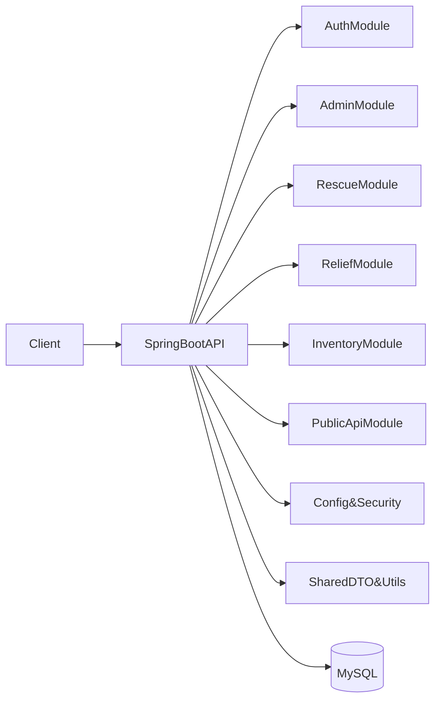

## Mục tiêu

- **PHẦN 1 – Code Review**: Đánh giá chi tiết logic, security, hiệu năng, error handling, concurrency, code quality và observability theo từng module chính (auth, admin, rescue, relief, inventory, publicapi, config).
- **PHẦN 2 – Architecture Upgrade**: Đề xuất kiến trúc chuẩn hóa API, tối ưu database, hardening security, bổ sung resilience và chuẩn bị cho scale lên mức cao hơn.

## Bối cảnh hệ thống hiện tại (tóm tắt)

- **Stack**: Java + Spring Boot monolith.
- **DB**: MySQL qua Spring Data JPA/Hibernate, schema quản lý qua SQL + `[src/main/java/com/floodrescue/config/schema/SchemaCompatibilityRunner.java](src/main/java/com/floodrescue/config/schema/SchemaCompatibilityRunner.java)`.
- **Auth/Security**: JWT stateless auth với `SecurityFilterChain`, filter `JwtAuthenticationFilter`, token utils trong `[src/main/java/com/floodrescue/config/security/JwtTokenProvider.java](src/main/java/com/floodrescue/config/security/JwtTokenProvider.java)`, method-level `@PreAuthorize` trên controllers.
- **Modules chính**: `auth`, `admin`, `rescue`, `relief`, `inventory`, `asset`, `team`, `user`, `map`, `notification`, `feedback`, `publicapi`, với shared layer trong `com.floodrescue.shared.`*.

Sơ đồ high-level (đơn giản hóa):

## Kế hoạch chi tiết – PHẦN 1: Code Review

### 1. Correctness & Error Handling

- **Auth module**
  - Rà soát luồng login/register/refresh/forgot/reset trong:
    - `[src/main/java/com/floodrescue/module/auth/controller/AuthController.java](src/main/java/com/floodrescue/module/auth/controller/AuthController.java)`
    - `[src/main/java/com/floodrescue/module/auth/service/AuthServiceImpl.java](src/main/java/com/floodrescue/module/auth/service/AuthServiceImpl.java)`
  - Kiểm tra edge cases: token hết hạn, refresh token bị revoke, reset password token trùng/lộ, nhiều lần retry login (`LoginAttemptLimiter`).
  - Chuẩn hóa error handling: đảm bảo toàn bộ exception flow về `[src/main/java/com/floodrescue/shared/exception/GlobalExceptionHandler.java](src/main/java/com/floodrescue/shared/exception/GlobalExceptionHandler.java)` và không bắt rồi trả `Map` thủ công.
- **Rescue & Relief workflows**
  - Review các phương thức thay đổi trạng thái (create, verify, prioritize, cancel, reopen) trong:
    - `[src/main/java/com/floodrescue/module/rescue/service/RescueRequestServiceImpl.java](src/main/java/com/floodrescue/module/rescue/service/RescueRequestServiceImpl.java)`
    - `[src/main/java/com/floodrescue/module/relief/service/ReliefRequestService.java](src/main/java/com/floodrescue/module/relief/service/ReliefRequestService.java)` và impl liên quan
  - Xác nhận logic chuyển trạng thái không có dead-end state, không bỏ sót edge case (vd: citizen xác nhận trễ, rescuer bỏ nhiệm vụ, duplicate request).
- **Admin & Inventory**
  - Rà soát luồng tạo/sửa user, role, permission, catalog trong:
    - `[src/main/java/com/floodrescue/module/admin/controller/AdminUserController.java](src/main/java/com/floodrescue/module/admin/controller/AdminUserController.java)`
    - `[src/main/java/com/floodrescue/module/admin/service/AdminUserService.java](src/main/java/com/floodrescue/module/admin/service/AdminUserService.java)`
  - Đảm bảo các transaction bao quanh đầy đủ khi thay đổi nhiều bảng.

### 2. Security (authz, input validation, secrets)

- **JWT & filter chain**
  - Phân tích chi tiết `JwtAuthenticationFilter` & `SecurityConfig`:
    - `[src/main/java/com/floodrescue/config/security/JwtAuthenticationFilter.java](src/main/java/com/floodrescue/config/security/JwtAuthenticationFilter.java)`
    - `[src/main/java/com/floodrescue/config/security/SecurityConfig.java](src/main/java/com/floodrescue/config/security/SecurityConfig.java)`
  - Kiểm tra:
    - Không log token/raw credentials.
    - Timeout & clock skew cho JWT.
    - Các endpoint `permitAll` không quá rộng.
- **Authorization & role checks**
  - Thống kê `@PreAuthorize` trên tất cả controllers (`admin`, `rescue`, `relief`, `inventory`, `asset`, `team`, `notification`) để đảm bảo:
    - Hành động nhạy cảm (quản trị, xoá dữ liệu, thay đổi trạng thái) luôn yêu cầu role phù hợp.
    - Nếu có rule theo ownership (user chỉ được sửa request của mình), xác nhận logic nằm consistent ở service layer.
- **Input validation & sanitization**
  - Xác định các nơi dùng `Map<String,Object>` thay vì DTO có `@Valid`, đặc biệt:
    - `[src/main/java/com/floodrescue/module/admin/controller/AdminCatalogController.java](src/main/java/com/floodrescue/module/admin/controller/AdminCatalogController.java)`
    - `[src/main/java/com/floodrescue/module/admin/controller/AdminUserController.java](src/main/java/com/floodrescue/module/admin/controller/AdminUserController.java)`
  - Lên plan chuyển sang DTO + Bean Validation (annotation `@NotNull`, `@Size`, `@Pattern`, ...).
- **Secrets & cấu hình**
  - Đánh dấu những secrets hardcode trong `[src/main/resources/application.properties](src/main/resources/application.properties)` (DB password, JWT secret, encryption key).
  - Đề xuất chuyển sang profile-based config + environment variables + `application.properties.example`.

### 3. Performance & N+1

- Dò các pattern N+1 trong repositories/services:
  - `RescueRequestServiceImpl` (vòng lặp gọi `taskGroupRequestRepository.findByRescueRequestId`, lazy access citizen/team).
  - `AdminDashboardServiceImpl` với `JdbcTemplate` để xem có thể gom query hoặc tối ưu index.
  - Inventory/Relief listing APIs: kiểm tra các `.stream().map(...)` truy cập nhiều association lazy.
- Đề xuất cải thiện:
  - Thêm `@EntityGraph` hoặc JPQL với `JOIN FETCH` tại repository.
  - Thêm DTO projection query cho dashboard/report lớn.
  - Rà soát `pageable` và limit trên các list endpoint.

### 4. Concurrency & Transaction

- Kiểm tra các method `@Transactional`:
  - Đảm bảo các write-flow phức tạp (tạo rescue request + attachment + timeline + notification) nằm trong 1 transaction atomic.
  - Xem có chỗ nào mix call đến external service (Mapbox, email provider) trong cùng transaction => cân nhắc tách ra event/queue.
- Đánh giá chỗ có nguy cơ race condition:
  - Cập nhật status rescue/relief/stock khi nhiều actor thao tác song song.

### 5. Code Quality & Observability

- **Code Quality**
  - Tìm chỗ lặp logic chuyển đổi entity/DTO => đề xuất trích ra mapper (MapStruct hoặc manual mapper reused).
  - Loại bỏ magic string/status, thay bằng enum hoặc constant central trong `shared/enums`.
  - Rà dead code, import thừa, entity placeholder rỗng (`PermissionEntity`, `SystemSettingEntity`).
- **Logging & metrics**
  - Kiểm tra logging hiện tại trong services quan trọng (`RescueRequestServiceImpl`, `AuthServiceImpl`, `Inventory*Service`).
  - Đề xuất chuẩn hóa log format (log info cho business event chính, warn/error cho exception) và các điểm nên thêm log.
  - Đề xuất tích hợp metrics (Micrometer + Prometheus) cho các endpoint quan trọng sau khi review.

## Kế hoạch chi tiết – PHẦN 2: Architecture Upgrade

### 1. API Design & Consistency

- **Chuẩn hóa response envelope**
  - Áp dụng `ApiResult<T>` cho toàn bộ controllers, đặc biệt các admin controllers:
    - `[src/main/java/com/floodrescue/module/admin/controller/AdminCatalogController.java](src/main/java/com/floodrescue/module/admin/controller/AdminCatalogController.java)`
    - `[src/main/java/com/floodrescue/module/admin/controller/AdminUserController.java](src/main/java/com/floodrescue/module/admin/controller/AdminUserController.java)`
    - `[src/main/java/com/floodrescue/module/admin/controller/PermissionController.java](src/main/java/com/floodrescue/module/admin/controller/PermissionController.java)`
  - Đồng bộ luôn cho security error (`SecurityExceptionHandler`) để trả về cùng structure.
- **RESTful conventions & versioning**
  - Rà soát path/method: đảm bảo `GET`/`POST`/`PUT`/`DELETE` dùng đúng semantics.
  - Chuẩn hóa base path theo version: ví dụ chuyển dần về `/api/v1/...` (có thể giữ alias `/api/...` trong thời gian chuyển đổi).
  - Thiết kế contract pagination/filtering/sorting chuẩn (query params `page`, `size`, `sort`, `filter[...]`).

### 2. Database & Query Optimization

- **Indexing & query patterns**
  - Dựa trên các repository & dashboard query, xác định key fields cần index: `status`, `created_at`, `city/district`, `team_id`, `user_id`, `role_code`...
  - Đề xuất cụ thể index (BTREE trên MySQL) và ghi chú tại `database.sql` +/hoặc migration tool.
- **Transaction & consistency**
  - Xác định luồng nghiệp vụ cần transaction cross-entity (rescue + notification, inventory issue + stock balance, relief distribution + assignment) và đảm bảo `@Transactional` đúng layer (service, không đặt ở controller).
- **Caching layer (chuẩn bị Redis)**
  - Đề xuất điểm nên cache:
    - Metadata ít thay đổi: catalog (item categories, units), permission set, system settings/runtime settings.
    - Dashboard aggregates (số lượng rescue/relief today, by area, by status) với TTL ngắn.
  - Thiết kế interface cache-agnostic tại service, sau đó có thể plug `Spring Cache + Redis` vào.

### 3. Architecture Pattern & Layering

- **Chuẩn hóa phân lớp**
  - Controller → Service → Repository rõ ràng; tránh đặt logic nghiệp vụ trong controller.
  - Đảm bảo mỗi service có interface + implementation (đã phần lớn có), để dễ test và thay thế.
- **Event-driven cho tác vụ nặng**
  - Xác định các tác vụ nặng/IO: gửi email/SMS, gửi notification, sync mapbox, báo cáo thống kê.
  - Đề xuất chuyển sang event/queue (vd: Spring events hoặc message broker như RabbitMQ/Kafka) và worker/background job.

### 4. Resilience & Observability

- **Retry & circuit breaker**
  - Các call external như Mapbox, SMTP/notification service: đề xuất bọc vào Resilience4j:
    - Retry với exponential backoff.
    - Circuit breaker cho endpoint không ổn định.
- **Timeout & graceful degradation**
  - Thiết lập timeout hợp lý cho HTTP client tới Mapbox/notification provider.
  - Nếu Mapbox fail, cho phép degrade (vd: lưu request với trạng thái "LOCATION_PENDING" thay vì fail toàn bộ flow).
- **Health checks**
  - Bật Spring Boot Actuator và expose `/actuator/health`, `/actuator/info` theo profile để phục vụ k8s/monitoring.

### 5. Security Hardening

- **Input validation schema**
  - Chuẩn hóa tất cả request body sang DTO + Bean Validation (`@Valid`) thay vì dùng `Map` freestyle.
  - Tách DTO cho mỗi use case (create/update/search) thay vì reuse 1 map chung.
- **CORS & headers**
  - Rà soát `[src/main/java/com/floodrescue/config/web/CorsConfig.java](src/main/java/com/floodrescue/config/web/CorsConfig.java)` để đảm bảo không mở origin/method/header quá rộng ở production.
  - Đề xuất dùng Spring Security headers (HSTS, X-Content-Type-Options, X-Frame-Options) tương đương Helmet.
- **Secrets management**
  - Chuyển tất cả secret từ `application.properties` sang env var/profiles; chỉ giữ mẫu ở `application.properties.example`.
- **Audit log cho hành động nhạy cảm**
  - Chuẩn hóa ghi log/audit khi:
    - Thay đổi role/permission.
    - Thay đổi status rescue/relief.
    - Thao tác inventory critical (issue/receipt).
  - Sử dụng `AuditLogService` theo consistent pattern.

### 6. Scalability & Deployment Readiness

- **Stateless design**
  - Xác nhận toàn bộ session state nằm trong JWT/DB/Redis (khi thêm) chứ không nằm trong in-memory state.
  - Kiểm tra `LoginAttemptLimiter` có dùng in-memory hay persistent store; nếu in-memory cần thiết kế lại để scale nhiều instance.
- **Connection pooling & DB load**
  - Đảm bảo HikariCP cấu hình phù hợp (max pool size vs DB capacity).
  - Rà soát nơi truy vấn nặng (dashboard) để tối ưu query và giảm load.
- **File storage refactor**
  - Thiết kế abstraction cho file storage (local vs cloud) thay vì hardcode `uploads/` path trong `RescueRequestServiceImpl`.
  - Chuẩn bị khả năng chuyển sang object storage (S3/GCS/MinIO) cho deployments nhiều instance.

## Todos (implementation roadmap)

- **review-auth-module**: Review chi tiết `auth` (controller, service, entities, security filter) về correctness, security và error handling.
- **review-rescue-relief**: Review chi tiết luồng rescue/relief về logic chuyển trạng thái, transaction, N+1, logging.
- **normalize-admin-api**: Chuẩn hóa admin controllers dùng `ApiResult`, DTO + `@Valid`, và exception flow về `GlobalExceptionHandler`.
- **security-hardening-config**: Thiết kế lại cấu hình security (CORS, headers, secrets, profiles) và chuẩn hóa `SecurityExceptionHandler` cho phù hợp envelope.
- **db-performance-caching**: Đề xuất index, tối ưu query trọng điểm, và xác định các điểm nên thêm cache + chuẩn bị Redis.
- **resilience-observability**: Thiết kế tích hợp Resilience4j, Actuator, metrics và chuẩn logging cho các module chính.
- **file-storage-refactor**: Thiết kế abstraction storage để thay thế phụ thuộc vào local filesystem cho uploads.

